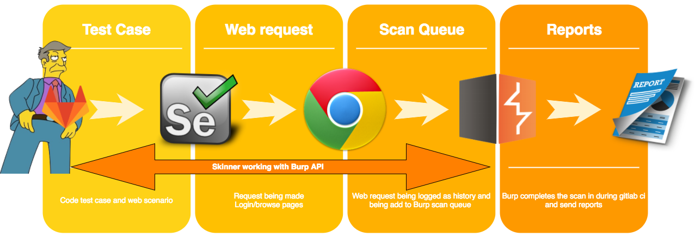
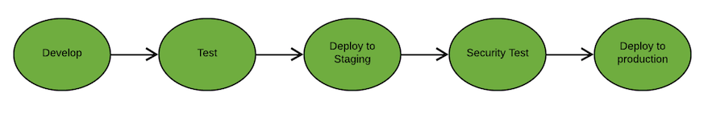
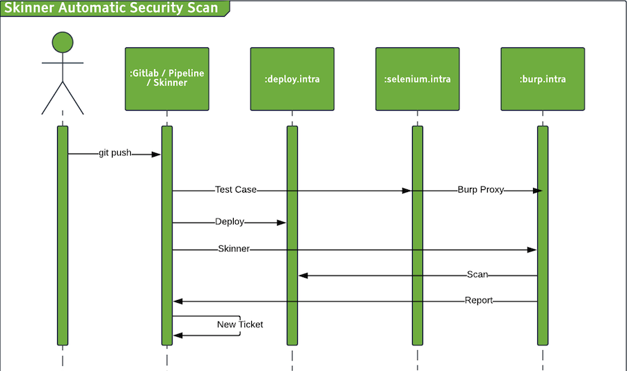
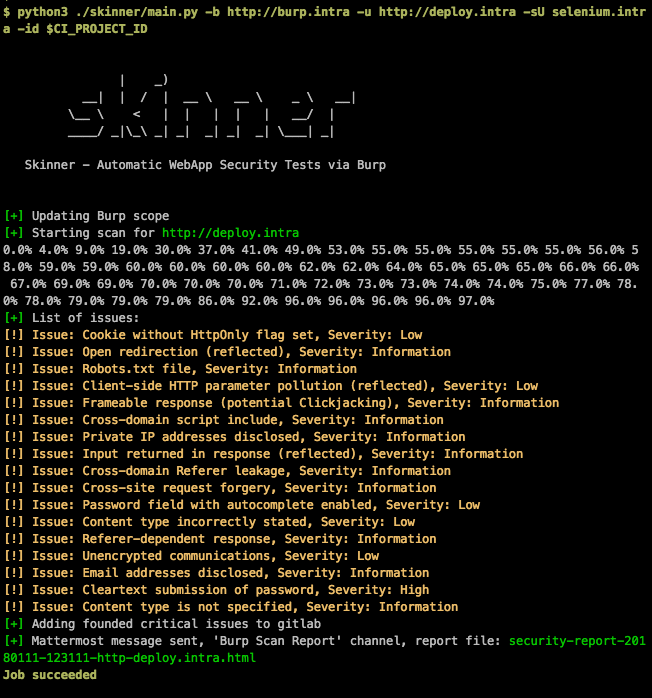
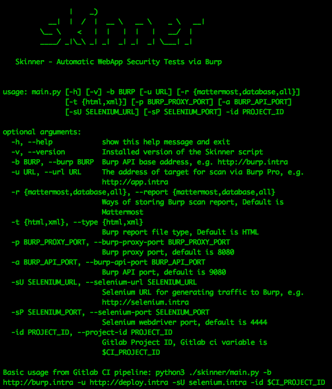

## Skinner - Automatic Web application Security Tests via Burp in CI pipeline

### Overview



An evolving framework that intend to integrate security tests in DevOps, this new trend being called SecOps, DevSecOps, Continues security, Test Driven Security or probably other terms, with the minimum configuration applied by developers it checks and test the application after each commit/push.

Skinner bonds different technologies together, written in python it runs on Gitlab CI and works with Selenium and Burp Suite Pro to automate security testing to find low hangigng fruites as fast as possible in pipeline with minimum interaction by developers. so this way "easy to find problems" gets fixed at early stages of development and security team can focus on bigger harder to find problems.

Skinner tries to add a security aspect to everyday development life cycle, it tests only the portion of application that is just changed so it can be fast and creates new gitlab issue for worthy findings, its developer friendly!

## How it works



The aim is automatically running everything after a push and recieve full report and new Gitlab tickets for critical security issues.

the main script (Skinner) will install and run in Gitlab CI pipeline.

at the minimum [test case configuration](https://gitlab.viidakko.fi/abdollah/auth-test), we have 3 stages:

1. unittest
2. deploy
3. securitytest

Skinner stand in CI/CD life cycle is after staging deployment and before production deployment and delivery. it can run for master branch or other branches at any step of development depending on infrastucture decisions and needs.



Services are as follow:

1. Gitlab CI pipeline, running stages that contains Selenium instructions, deploy stage and security stage running Skinner.
2. Deployment server (deploy.intra).
3. Selenium server (selenium.intra).
4. Burp Suite Pro API server (burp.intra).

[Test project](https://gitlab.viidakko.fi/abdollah/auth-test)

#### 1. first stage (unittest):
CI runs all the normal php unit test and also Selenium instructions that in this case can be found in ([security_test.t.php](https://gitlab.viidakko.fi/abdollah/auth-test/blob/master/Test/security_test.t.php)), we are using [Facebook php Selenium WebDriver](https://github.com/facebook/php-webdriver) it connects to `selenium.intra` and tries to browse through different pages of appliation, login and etc, because selenium browser's proxy is configured to use Burp Suite (`burp.intra`) to proxy the requested traffic so we will have browsed addressess in Burp Suite history that will be added to the scan scope by
Skinner at securitytest stage.

#### 2. second stage (deploy):
Connects to `deploy.intra` and pull latest changes.

#### 3. third stage (securitytest):
Runs Skinner script, Skinner connects to `burp.intra` via Burp Suite Pro API and configure, manage scope and start the scan. status can be monitored via Gitlab CI web console and after the scan it lists all the founded issues, sends issue list and report to mattermost channel (`Burp Scan Reports`) and create new ticket for "High Severity" issues in Gitlab containing all details and also full report.



### Usage

At the most basic use case a developer only need to specify the addresses that need to be scanned in selenium test file (security_test.t.php).

`$driver->get('http://deploy.intra/installations');`

If login is needed to browse restricted pages:

```
$driver->get('http://deploy.intra');
$targetUsername = 'elias@viidakko.fi';
$targetPassword = 'tropiikki';
$element = $driver->findElement(WebDriverBy::name('login'));
$driver->getKeyboard()->sendKeys($targetUsername);
$driver->getKeyboard()->pressKey(WebDriverKeys::ENTER);
$element = $driver->findElement(WebDriverBy::name('password'));
$driver->getKeyboard()->sendKeys($targetPassword);
$driver->getKeyboard()->pressKey(WebDriverKeys::ENTER);
```

#### Skinner CLI



### How to add it to your project?

1. Make sure you have published deploy server for latest changes (`deploy.intra`)
2. `selenium.intra`
3. `burp.intra`
4. Add [Facebook php WebDriver](https://github.com/facebook/php-webdriver) to your project
5. Write [selenium test file](https://gitlab.viidakko.fi/abdollah/auth-test/blob/master/Test/security_test.t.php)
6. Update [gitlab-ci.yml](https://gitlab.viidakko.fi/abdollah/auth-test/blob/master/.gitlab-ci.yml) containting deploy and securitytest stages
7. Skin your app alive! xD

## Contribute

### configuring local environment

#### 1. Build Burp API

[vmware burp rest api](https://github.com/vmware/burp-rest-api), for this you need to have Burp Suite Pro License.

After building burp-rest-api.jar and running it, you can access api endpoints via `http://localhost:8090/swagger-ui.html`

PS: this will change when Burp Suite official API released.

#### 2. Start Selenium Container

`docker run -d -p 4444:4444 selenium/standalone-chrome`

You can access selenium from browser via `http://localhost:4444/wd/hub/static/resource/hub.html`

#### 3. Environment

The application should be accessible with browser, [Platform](https://gitlab.viidakko.fi/labs/platform) and [Environments](https://gitlab.viidakko.fi/labs/environment) is prefered to be be used.

#### 4. Config.ini

Contains application username and password for selenium authentication. also mattermost and gitlab info can be changed.

For local development selenium instructions can be found at `traffic.py` file (function call and import lines need to be uncommented from `main.py`)


### TODO

* [x] Start/stop/reset burp with the script
* [x] Manage burp configuration
* [x] Burp with [Selenium](https://support.portswigger.net/customer/portal/articles/2669413-using-burp-with-selenium) , require writing Selenium testcases
	- https://github.com/SeleniumHQ/docker-selenium
	- https://github.com/facebook/php-webdriver
* [x] Filter out only critical issues for gitlab issue
* [x] Add issue to gitlab after scan
* [x] Better logs and gitlab ci compatible progress bar
* [ ] publish Skinner and proxyplugin.zip packages for debian
* [ ] handling Burp job queue
* [ ] Add issues and scans to database for false positive check and security intelligence (issueId, scanId)

### Refrences

1. https://github.com/vmware/burp-rest-api
2. https://github.com/Vaelor/python-mattermost-driver
